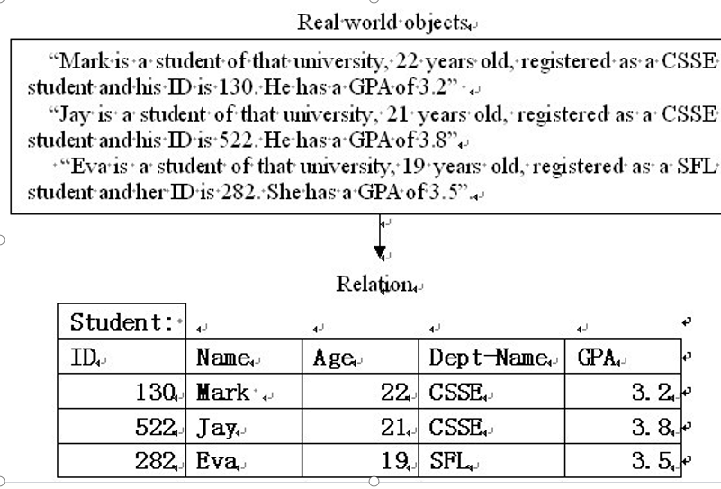

# 2
### 主键
superkey<key(candidate key)<primary key

>key为子集均不为superkey的key

>primary key在key中选择

>定义中的主键可以被候选关键字替换

### 外键
定义略
>使用关系的外键引用另一个关系的（主键）键是关系数据模型用来在不同关系之间建立关系的方式。

### 实体完整性和参考完整性

对于一个或多个属性的“允许”值，也存在一组约束。
  域约束

此外，大多数DBMS允许附加（一般）约束，称为
用户指定的完整性约束

####  实体完整性
> 真实世界和数据库对应相关的完整性
> 因此需要主键
> 唯一对象在数据库中可识别且唯一
>主键中不含null

### 参考完整性规则
>数据库不能包含任何不匹配的外键值。

三种处理方式

>仅当不存在外键时更新/删除

>更新/删除操作级联以更新/删除外键条目

>更新/删除主键值后外键项中为空（或默认值）

### 域约束(域完整性)
类型,值域等

>(用户定义完整性?)
### 静态约束和动态约束
和域约束不为平行关系..

始终保持值域
>如员工工资小于经理工资

动态约束
具体不懂..
