# sql3
>### 3.1 关系代数（RA）
>3.2 使用RA的简单和复杂查询
3.3 结构查询语言（SQL）
3.4 创建SQL数据库和表
3.5 选择数据
3.6 数据插入、更新和删除

### What is RA
relational algebra
关系代数是用于处理整个关系集的操作的集合。任何关系代数运算的输出总是一个关系。
####  操作呢?
并交集,差分,笛卡尔积
选择 投影 连接

任何关系代数运算的输出总是一个关系。

1.U并集
> 需要有相同的度
> R[i]和S[i]属性的域必须相同
>
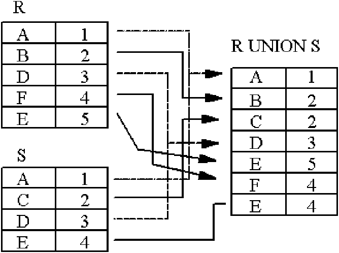

2.-关系差
> R S R-S

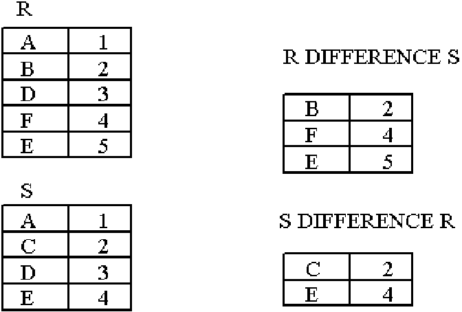

3.n 交集
同上
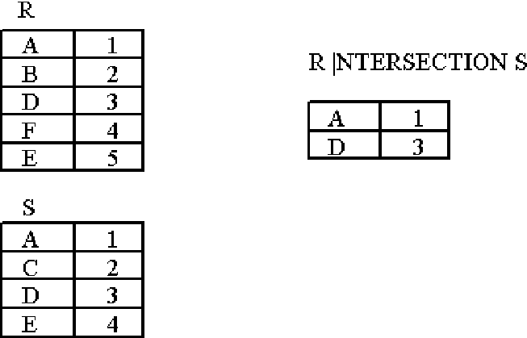

4. X 笛卡尔积
相乘,不是相加

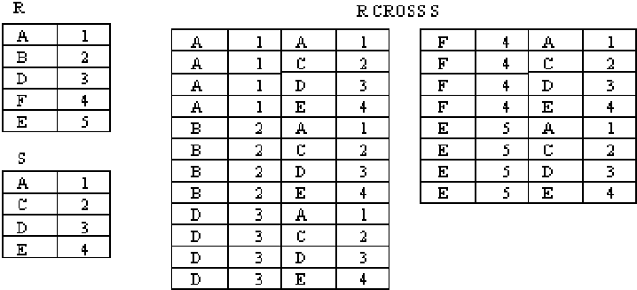

5. select
找到19岁的学生。
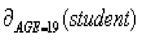
年龄为20，姓名为钟伟龙
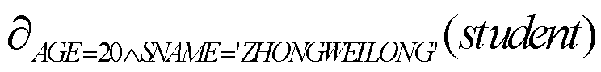

### 投影操作 π
πage(student) 
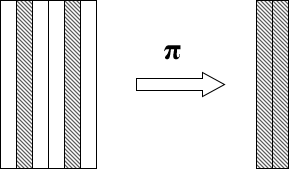

年龄为20岁的学生的姓名: 
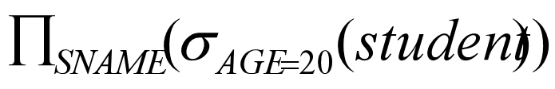

Join ()
 无限符号
 加入()

Theta JOIN
EquiJoin
>自然联接
左侧外部连接
右侧外部连接
完全外部联接
 C<E
 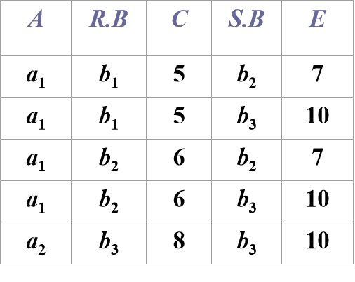

仅仅使用=
则为等联结

### 自然连接（*）
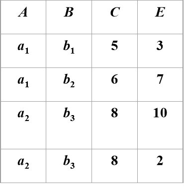

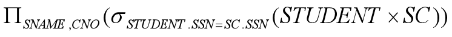
只有一个相同时,可省略
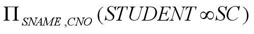

### dangling tuples:悬挂元祖
不参与联结的那些元祖
由此分为三种
1. 左外部联结
2. 右外部联结
3. 完全外部联结

1.左侧,保留r1所有悬空元祖
2.右侧,如上
3.全联结,全保留

### 外部连接的优点是从不兼容并集的两个关系中获取元组的并集。
无限符号某边+=
r1 =无限 r2 zuolianjie

### division
不支持作为原始运算符,可以表示查询
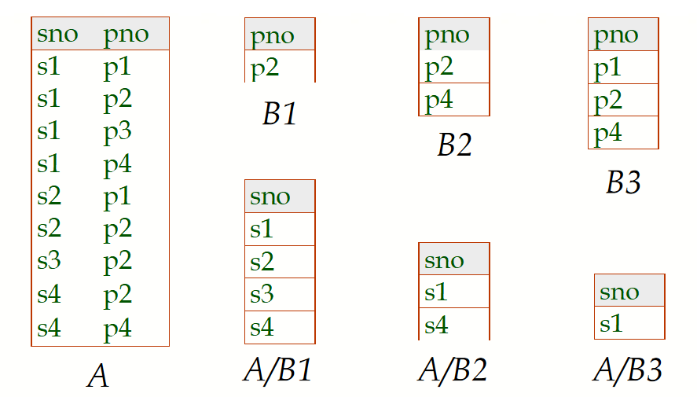
