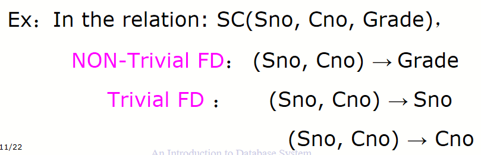
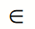
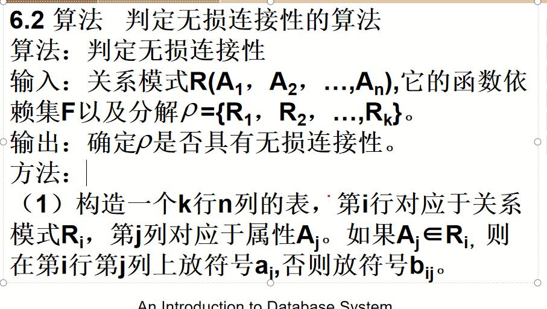

# sql4
A->B
则t1[A]=t2[A]->t1[B]=t2{b}

两种关系
x->y 且y属于x
则为Trivaial FD(普通?)
不过不属于,则为non-Trivaial 

全||部分
完全依赖于和部分依赖于
部分为
CNO,CNAME->CLOCATION
全则为
CNO->CLOCATION

依赖具有传递性

Relation Decomposition
Lossless Join Decomposition
Dependency-Preserving Decomposition
Finding Candidate Keys from FDs
Before that ….
Identify Functional Dependency
Consider all the implied information

关系分解
无损连接分解
依赖保持分解
从FD中查找候选密钥

在此之前…
确定功能依赖性
考虑所有隐含的信息

同一年员工工资相同
年份->工资

阿姆斯特朗的公理
y属于x,则x->y
x->y 则xz->yz
x->y y->z = x->z

x->y x->z x->yz
x->y wy->z wx->z

F下X的闭包
X+={A|X->A F+}
设F为属性集U上的一组函数依赖，X⊆U，XF+ ={A | X→ A能y由F根据Armstrong公理推导出 }，XF+ 称为属性集X关于函数依赖集F的闭包。

### 求出candidatekey
1.算出每一个Ai+
如果=全部,则其为candidatekey
2.对于aiaj,如果其中一个是候选码,则aiaj不是候选码
计算aiaj+
如果是全部,则为候选码
3.后面同理

或者画图
全出+都有
全入则必无

### 无损连接性

还没学
后续再看
