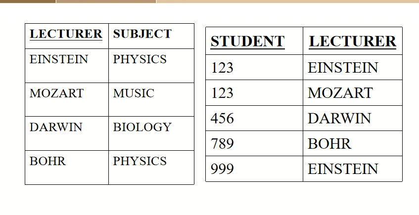

# sql5
### 第一范式
> 字段是最小的的单元不可再分
> 
没有重复行,一行一个,普普通通的表即可
### 第二范式
> 满足1NF,表中的字段必须完全依赖于全部主键而非部分主键

无部分依赖
非主要属性在功能上完全依赖于主要关键字
可将表分为多个表
相互依赖的属性在同一个表

### 第三范式\
> 满足2NF,非主键外的所有字段必须互不依赖

2NF加上无传递依赖性
请删除传递依赖关系中涉及的属性，并将它们放入新的关系中

### BCNF
> 满足3NF,消除表中的多值依赖
CNF中的所有依赖的左部都必须包含候选键。
给予行列式,每个都是超键
如果每个行列式都是超键，则在BCNF中存在关系。
BCNF适用于具有多个候选关键字的关系，并且候选关键字是复合的和重叠的。
考虑以下关系
SSL（学生、科目、讲师）
BCNF

如果关系模式不在中，则将其分解为一组模式，
以便
每个新模式都在BCNF中；
它是一种无损连接分解；
它是一种依赖性保持分解。

### LLJD-DPD-3NF分解成3NF
1、先把右边的多属性分成单个属性
2、判断是否存在冗余的依赖，即判断去掉一个依赖后是否成立
3、判断是否存在无关属性，即判断左边有多个值去掉一个是否还成立

输入：关系模式R，R中的一组FD F。

输出：无损连接和保留依赖关系的分解D，使得D中的每个模式都在3NF中。