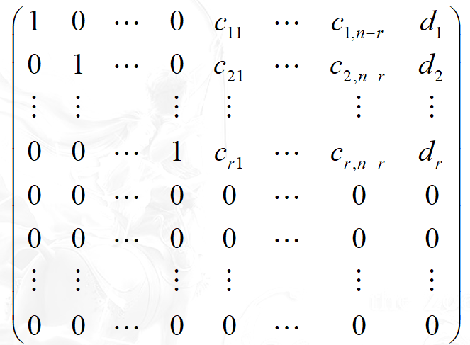

# C1
### 矩阵
#### 1.1.1定义
由方程组转化来

将a取出后排成矩阵数表

就是矩阵
#### 应用

> 由mxn个数按一定的次序排成的m行n列的矩形数表,称为mxn矩阵,简称矩阵.横排称为矩阵的行,竖排称为矩阵的列.  称为矩阵的第i行j列的元素.

__定义:mxn个数字构成的形如
的矩形数表即为矩阵,aij为矩阵i行j列的元素:A=(aij)m*n__

当m=n时,矩阵行列相同时,矩阵为方阵

a11 a22 ... ann->主对角线,上面的为主对角元
主对角线全为1,其他均为0,则为单位矩阵

#### 方程组转化

对于该方程组
系数矩阵就是
A=(aij)m*n
增广矩阵则在后面加上答案bj

> 举例 

## 例题

### 阶梯型方程组定义
 (i)  如方程组中某一方程的各项系数(含常数项)全为零, 则它下方的所有方程(如有)的各项系数全为零; 
(ii)如方程组中某一方程的各项系数(含常数项)不全为零, 并且第一个不为零的项是第 i 项, 则此方程下方的所有方程(如果存在)的第i 项的系数全为零.
> 

初等变换

> I.  交换某两个方程的相互位置； 
II.  用一非零数乘以某一方程;
III.  某一方程乘以一数后加到另一方程上.

### 1.2.1定理 一线性方程组经若干上述初等变换后得到的方程组与原方程组同解.

得到定义1.2.1,此处略

从上往下计算,一般取上三角矩阵

### 定理1.2.2 任一矩阵经若干次初等行变换后均可化为阶梯型.

## 矩阵的(行)最简型
### 定义1.2.3  一阶梯型矩阵称为最简型
若其非零行的第一个非零元素均为1，并且此元素所在列的其他元素均为零。\

但是用不到?一般都是上三角就可以了吧..

### 1.2.1 初等列变化: 类似行变化

## 1.3线性方程组求解

AX=b..

> 
(1) 当dr+1!=0时,  方程组无解.
(2) 当dr+1 =0时，方程组有解.
(2-1)r=n 
(2-2) 当r<n
则将xr+1, xr+2,, xn作为自由未知量, 
方程组有无穷多组解.

### 齐次线性方程组
就是AX=0

### 1.3.2 该方程组只有两种情况
1.只有0解
2.有无穷解

#### 定理 如果m<n 则有非零解

我悟了!
