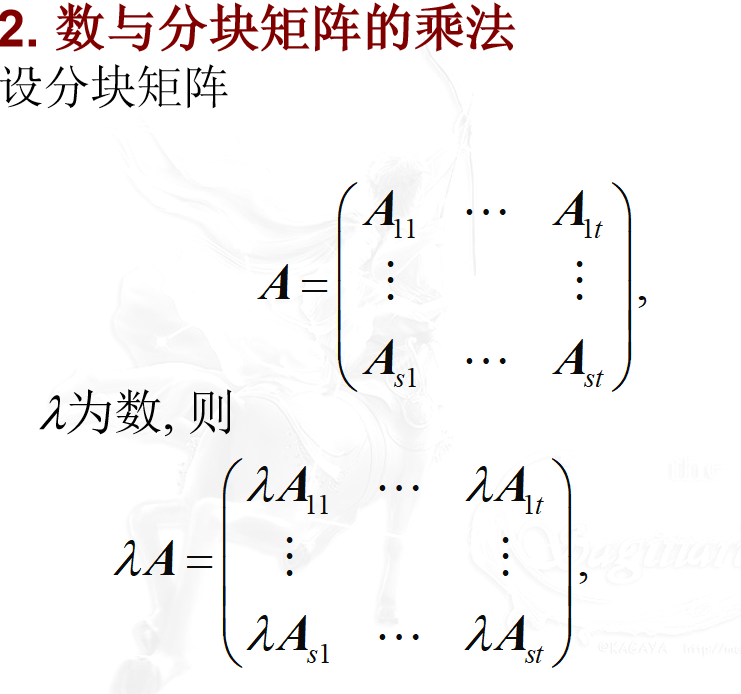
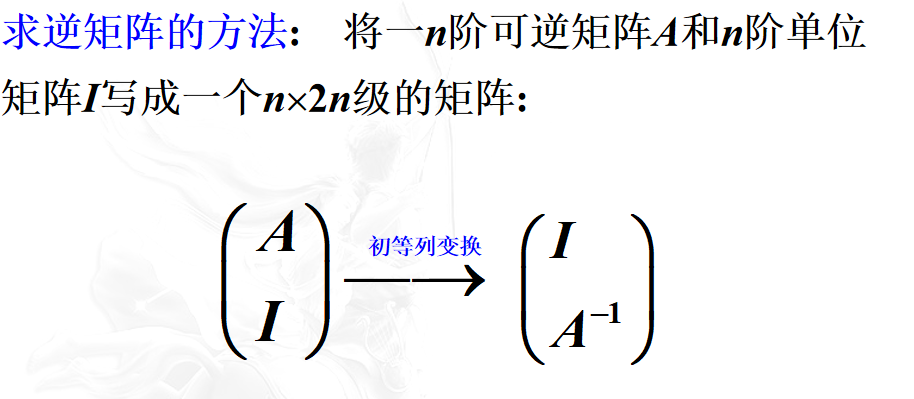

# c2
### 乘法
矩阵与矩阵

#### 例题

### AB!=BA
### 可交换
 
>1.AB!=BA
>2. AB=O!->A=O|B=O
>3. AM=AN!->M=N

### 转置

>

### 对称

当且仅当AB=BA时成立,可交换

## 分块矩阵

### 按列分块矩阵

### 按行 略

### 加法
直接加啊?

### 乘法

直接乘啊?

### 分块对角矩阵

> 
### K次方

## 逆矩阵

对于方阵A,如果有方阵B使得AB=BA=In
则AB可逆且互为逆矩阵
> 逆矩阵也是可交换
> 可逆矩阵一定是方阵, 并且其逆阵为同阶方阵; 
> AB逆矩阵,则A-1=B,反之亦然

### 如果n阶方阵A可逆,则转置矩阵

### 如果A可逆,且AB=O,则B=O
### 如果A可逆,且AB=AC,则B=C 仅可逆时成立
### AB)-1=B-1A-1

## 初等矩阵
将__单位矩阵__ 进行 __一次__初等变换得到的矩阵为初等矩阵

1.交换i行j行 为I型初等矩阵

2.将i行*非零k为二型

3.将i行*k后加到j

## 用初等矩阵计算后就是原矩阵相同初等变换后
### 左乘为行变化

### 右乘为列变化

## 例题

## 矩阵可逆的充分必要条件
> 定义2.4.1  设A, B均为mn级矩阵．如存在初等矩阵P1,  P2, …,  Pk 使得
B＝Pk…P2 P1 A
则称A行等价于B．

反过来应该是列等价..
### 定理

(1) A可逆
(2) AX=O仅有0解(无关())
(3) A行等价于I
(4) A可为若干初等矩阵积

## 例题💯

### 求逆矩阵

转化->
A-E)X=B
然后用求逆矩阵的方式即可

总结
AB=BA 可交换
AT=A 对称
AB=BA=I 可逆