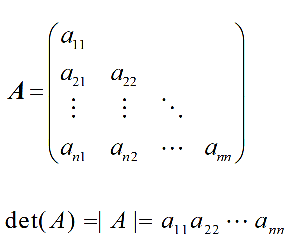
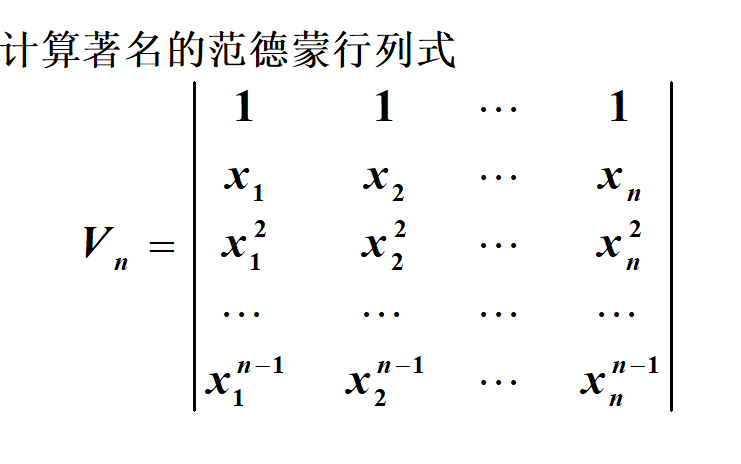

# c3
### 方阵的行列式
#### 二阶

意义
是解的分母

#### 三阶段

四阶段不行哦

#### 一阶方阵的行列式

#### 多阶的

## 他的结果

>去掉|A|中aij所在的第i行和第j列, 得到一个n-1阶行列式，称为|A|中aij  的余子式,记为Mij.

>将Mij带上符号(1)i+j, 称为aij的代数余子式, 即    Aij=(1)i+j Mij

三阶举例

__加起来就是结果,难道是巧合?__

组合排列之后还可以是
a1iA1i
a2iA2i
a3iA3i
结果都是意义

#### 泛式

### 三角

### 行列式的性质
1.交换行列式某两行(列), 行列式的值反号.
推论:
2.一n(n>=2)阶行列式中，如有两行(列)元素完全相同，则此行列式为零. 
> 调换后值相反->|A|=|-A|

如果不是方阵
如果不是方阵
当i!=j...

### 行列式数乘法 只乘一列

### 性质推论
1.若行列式Dn 中某一行(列)元素全为零，则此行列式为零.
> a=0 aA=0
2.一n(n>=2)阶行列式中，如有两行或两列元素对应成比例，则此行列式为零. 
> 如有两行(列)元素完全相同，则此行列式为零.->*k
> 还是0 来自性质1

性质3

不同的才相加,相同的不想加

### 性质
任意倍加到另一行,值不变
由上得: 

### 性质 三角

### 行列式的计算

解后去a2 然后/2/3 之后2+4

四列合一,然后三行-四,最后

一个个加即可

向右加

太难

?

?

?

?

### 应用
#### 1.伴随矩阵

伴随矩阵每一项都为aji的代数余子式
A*

AA*
=
A*A
=
det(A)I

### 定理
矩阵可逆的充分必要:det(A)!=0
此时
A-1=1/det(A)A*
A*=A-1det(A)
AA*=det(A)

### 引理
det(AB)=det(A)det(B)
推论
BC=I
则B-1=C

## 克莱姆（Gramer）法则

> 如（8）形式的线性方程组AX= ，则此方程组解存在且唯一的充分必要条件是A可逆, 并且其唯一解为
X0＝A1

### tuilun

