# juzhen
### 加减乘除
每个元素均是

矩阵乘常数:里面每一个都乘

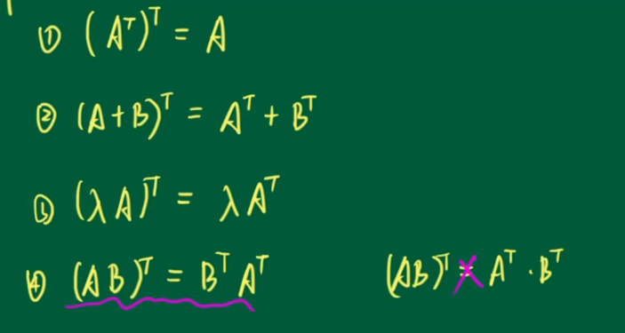

> 注意注意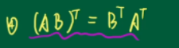

矩阵乘矩阵
r*T
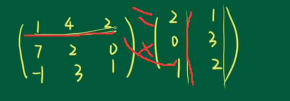
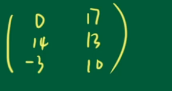

A=-AT(符号)
则A为反对称阵
 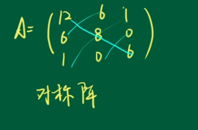
对称阵(正)
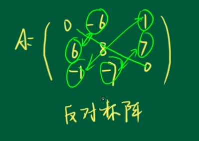
对称阵(反)

系数矩阵
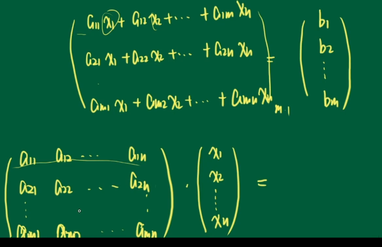
两者相乘 
等于后面那一列
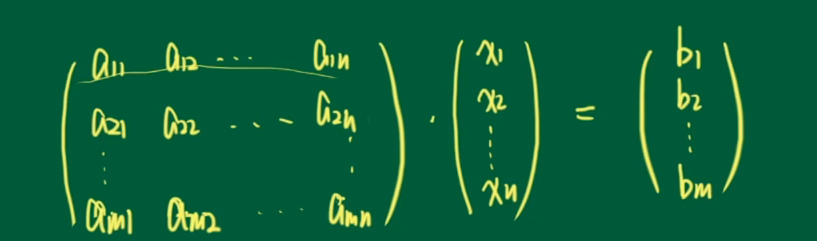
### 线性变换
略?
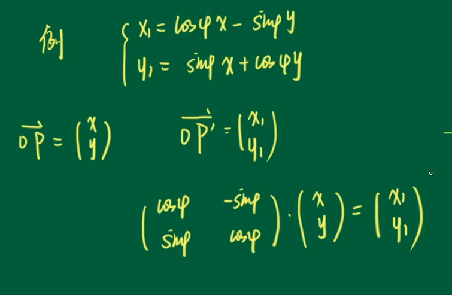

An(x  = 旋转,先不管
    y)

  ### 例题
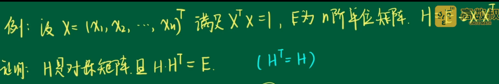
证明出Ht=H
所以是对称
由于

所以HHt=H2=E-2xxt)2
=E2- 4XXt +4XX=E

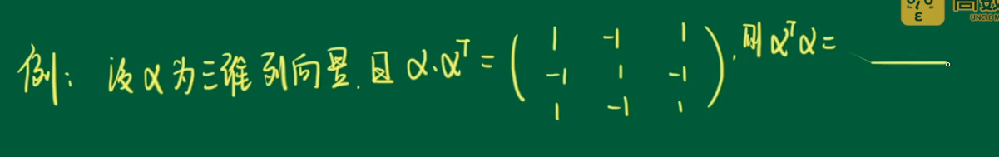
 
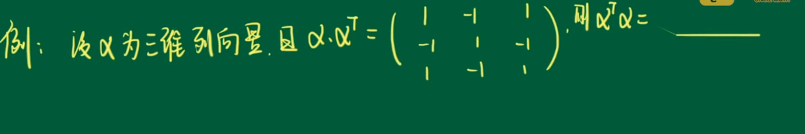

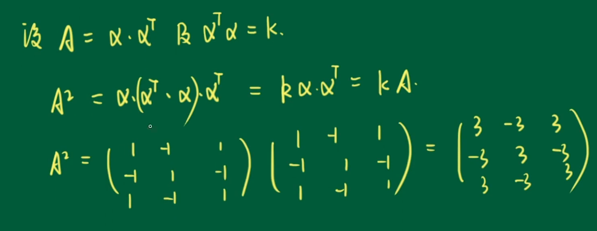

## k=3

## 方阵的行列式

定义

|A|    or det(A)

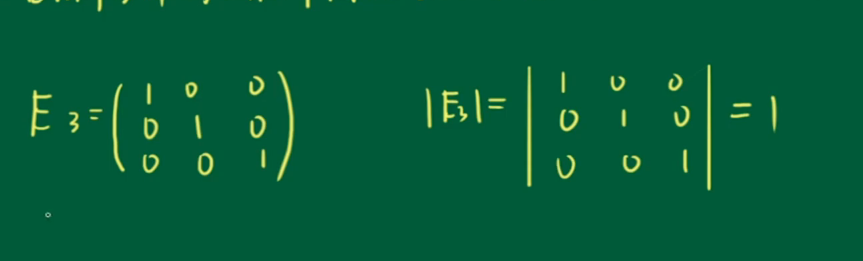

{方阵 有运算}
(1)|At|=|A|

(2)|nA|!=n|A|
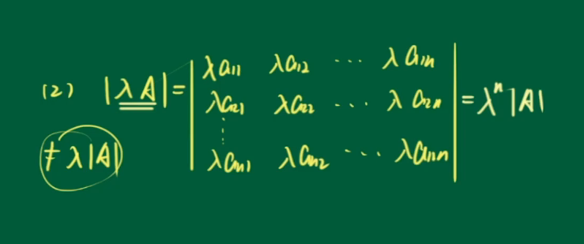

(3)|AB|=|A||B|=|B||A|
主要看前者
证明:由题可得 AB为同阶矩阵
A=(aij)n
B=(bij)n

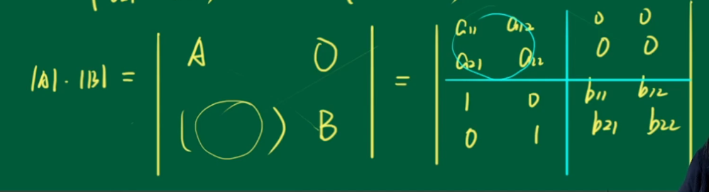

C3-b11C1

### 伴随矩阵 A*
行列式|A|各个元素的代数余子式为Aij所构成的矩阵再颠倒

A11 A21...
.
.
..........Ann
=A*
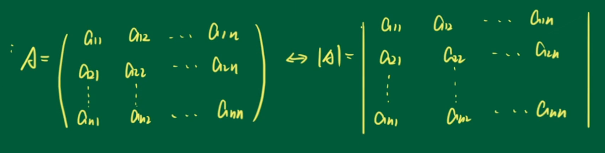
每个代数余子式 取出来
>记住:代数余子式的正负!

性质
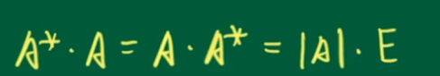
A*A=AA*=|A|E

## 逆矩阵
ab=1--->b=a-1=1/a
AB=E-->B=A-1!=1/A
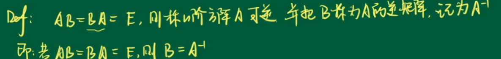

>逆矩阵唯一

什么时候有?
|A|!=0时,有逆矩阵
<->A可逆->非奇异矩阵

|A|!=0时,A可逆,A-1=(1/|A|)*A*

2.AB=BA=E A-1=B B-1=Aij
A-1)-1 = A
->A-1=B 
BA=E

AT-1=A-1T
3.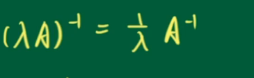

AB-1=B-1A-1

### 立体
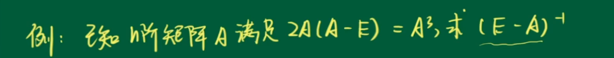
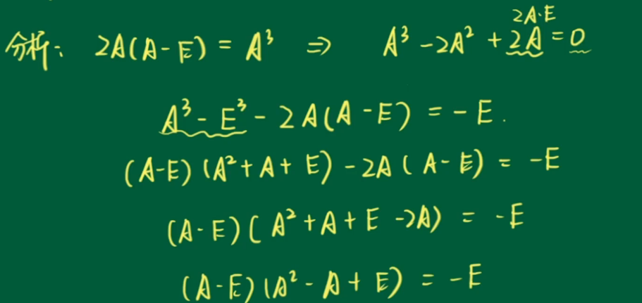

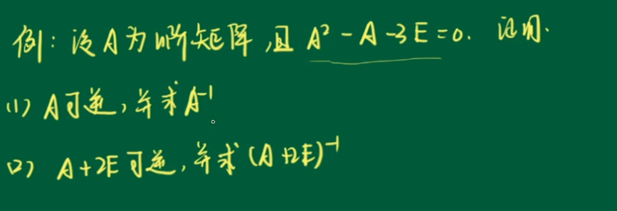
1证明:|A|!=0或者 A()=E 1->E
2.凑gongshi

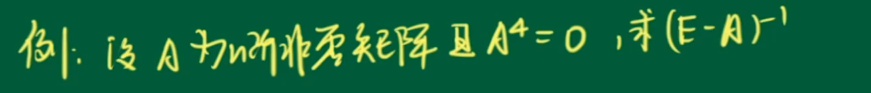
A4=0,得到E-A4=E
带入计算即可

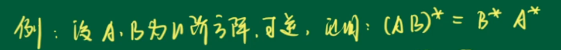
公式:|A|!=0时,A可逆,A-1=(1/|A|)*A*

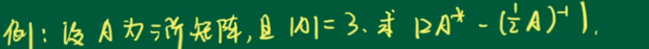
 (nA)-1=1/n A-1
 |A-1|=1/|A|
 n=^m
 