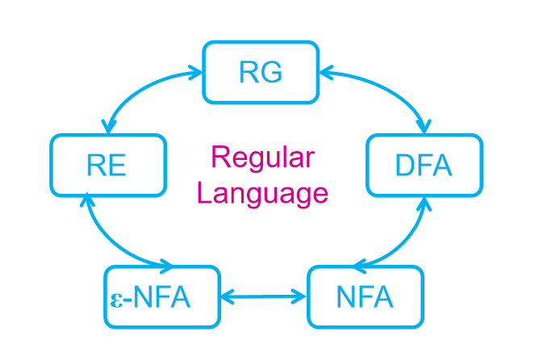
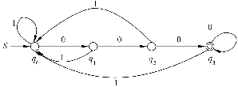
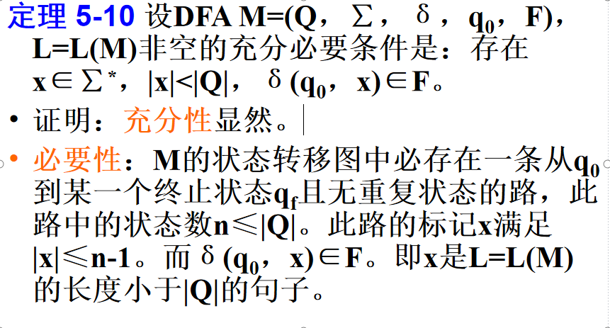
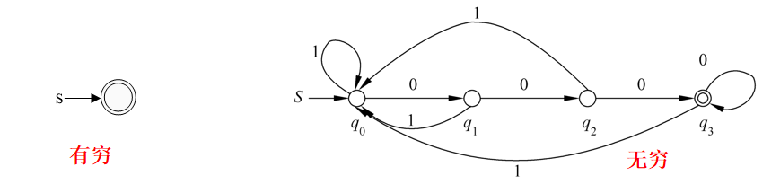
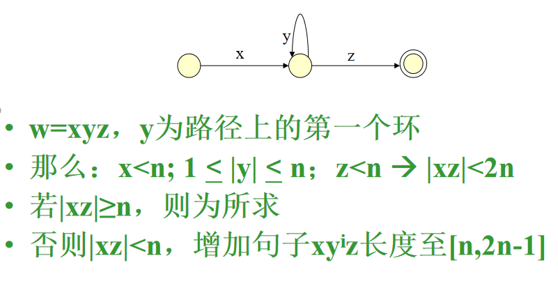
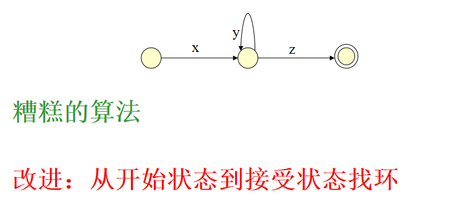
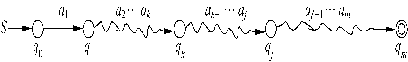
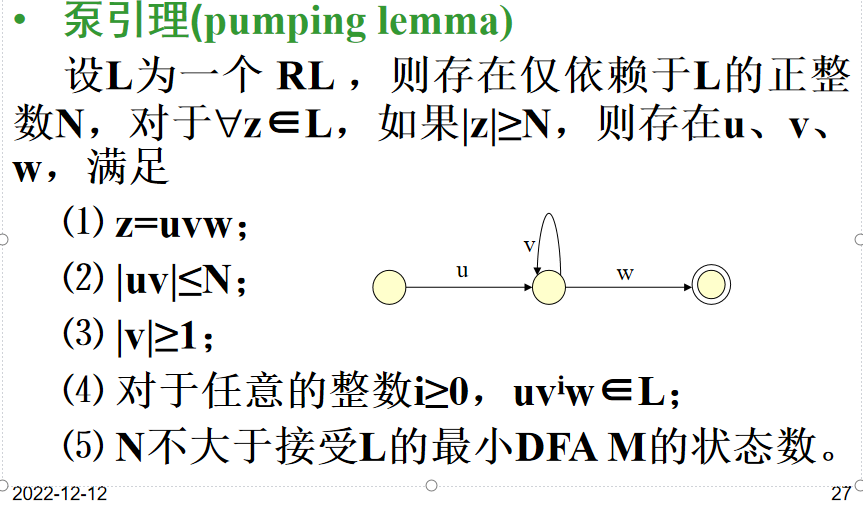
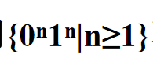
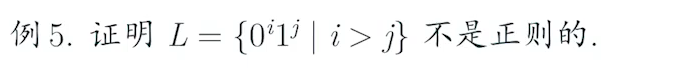

# 正则语言性质

两种性质: 
1.判定性质
2. 封闭性质

### RL性质
判定: 泵定理 和应用
封闭性质 并、乘积、闭包、补、交

### 判定性质

以语言的形式化描述(例如：DFA)作为输入，判定某些性质是否成立的算法。

例子:DFA对应的语言L是否为空？
成员关系：“w是否在正则语言L里？”
空否：“DFA对应语言是否为空？”
有穷否：“DFA对应语言是否有穷？”
“语言L是否为正则语言？”→ __泵定理__
两个DFA等价否：“两个DFA对应语言是否等价？”

#### why dun it  
当我们用DFA来描述协议(protocol)，该协议的重要性质跟DFA对应的语言相关。如
>“该协议是否会终结？”=“该语言是否是有穷的？”
“该协议是否会失效？”=“该语言是否为非空的？”

我们经常想要一个“极小的”语言表示，比如一个拥有最少状态数量的DFA或者一个最短的RE
>如果我们不能判定“两个语言是否等价？”
或者，“两个DFA是否对应相同的语言？”
    我们就无法找到“极小”

成员判定: w是否在L中
L用DFA M描述
w输入时,M状态转移

if rl 不是DFA描述?
### 设L是字母表∑上的 RL ，对任意x∈∑*，存在判定x是不是L的句子的算法
### 例题
给定一个正则语言L, 问：该语言是否包含任何字符串？即L是否为空？

假设语言为DFA
1.构建状态转移图
2.从q0出发,所有可达到状态的集合
3.若任何接受状态可到达,则非空
### 定理 1. 空否判定

M的状态转移图中必存在一条从q0到某一个终止状态qf且无重复状态的路，此路中的状态数n≤|Q|。此路的标记x满足|x|≤n-1。而δ(q0，x)∈F。即x是L=L(M)的长度小于|Q|的句子。 
 ### 2. 无穷判定
给定一个正则语言L, 问：该语言是否无穷
若该DFA有n个状态, L包含长度"大于等于"n的字符串，则该语言无穷。
否则，该语言L一定是有穷的。
包含长度?

### 证明💯
>如果一个DFA有n个状态，并接受长度大于等于n的字符串w，那么在w的路径上，一定包含一个状态出现了至少两次。

---
headingNumber: true
wrapCode: true
enableMacro: true
mdOptions: { linkify: true, breaks: true }
define:
    APP_NAME: Yank Note

___________上面为单个语言的判断________________
没有有效算法,大于等于n的字符串无穷个,无法穷举
#### Second idea：如果L包含长度大于等于n的字符串，那么一定包含长度介于n跟2n-1的句子。

证明：

算法: 
检验所有长度[n,2n-1]的句子，如果有句子被接受，则该语言无穷。
确实很糟糕啊

## 泵引理!@!!!!!
在无穷判定中, 我们无意中提供了一个证明一个语言是否正则语言的重要结论。

定义💯
设L为RL,则存在仅依赖于L的正整数N,对于所有z属于L,
|z|>=N
则存在uvw满足
1.z=uvw
2.|uv|<N
3.|v|>=1
4.对于任意i>0,uviw属于L
5.N不大于接受L的最小DFA M的状态

证明思想

证明：DFA在处理一个足够长的句子的过程中，必定会重复地经过某一个状态。换句话说，在DFA的状态转移图中，必定存在一条含有回路的从启动状态到某个终止状态的路。由于是回路，所以，DFA可以根据实际需要沿着这个回路循环运行，相当于这个回路中弧上的标记构成的非空子串可以重复任意多次。 
感觉还是看视频学比较实际...

例子💯

证明
不是RL

假设为RL
z=0N1N
v=0k
则u=0N-k-j
w=0j1N
uviw=0N-k-j(0k)i1N=0N+(i-1)k1N
i=2时,
0N+k1N
所以不是Rl

2.证明{0n|n为素数}不是 RL。
设L=0n是
z=0N+p
v=0k k>=1
uviw=0N+p-k-j(0k)i0j=0N+p+(i-1)k

i=N+p+1时
..=N+p(1+k)
k>=1
所以巴拉巴拉不是矛盾
没明白..

用来证明一个语言不是 RL
不能证明是

等价判定
给定RL语言L与M，是否L=M？
从L跟M的DFA出发，构建一个乘积DFA 是啥?
让L跟M的DFA拥有状态集Q和R

乘积DFA有状态集为Q  R
即，对于q∈ Q, r∈ R, [q,r]是乘积DFA的一个状态

设DFA  M1=(Q1，∑，δ1，q01，F1)， DFA M2=(Q2，∑，δ2，q02，F2)，则存在判定M1与 M2是否等价的算法。 

