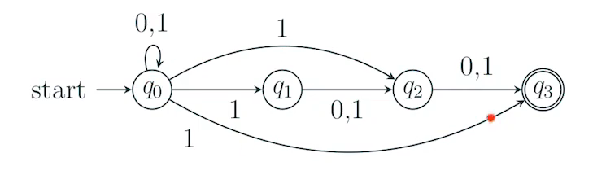
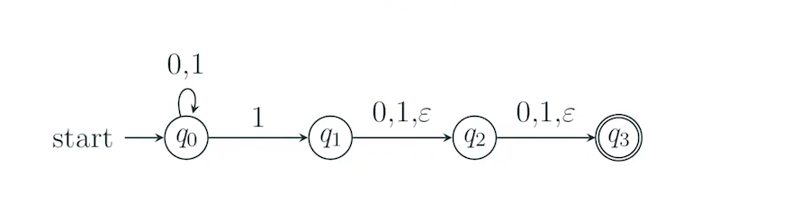
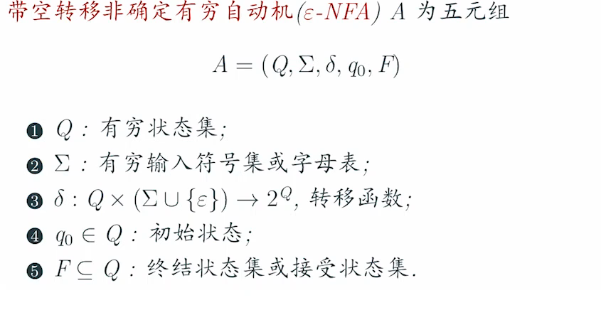
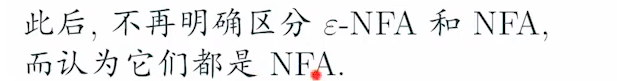

# 空NFA
带空转移的非确定有穷自动机

#### 例题11: 

如果是三个中有一个,则q1q2换为非结束状态
#### 利用非确定性

#### 利用空

### 定义

状态集 输入集 函数 初始 结束

例题

图上作业法
预处理:+XY
去除
> 1 串联r1和r2用r1r2代替
> 2 串联带自循环 r1r2*r3
> 3 并联 r1+r2
> 4 剩3个,且无X到Y,则全部删除!